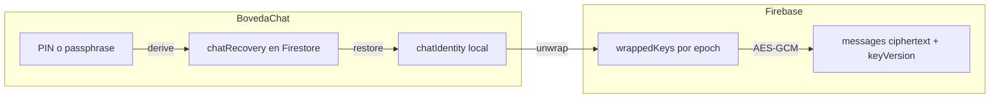

# Plan: rediseño E2E Moments (social + recuperable + anti-brick)

Fecha: 2026-07-30  
Estado: propuesta (aún no implementada por fases)  
Fuente de verdad del protocolo actual: iOS (`Moments/Moments/Services/Messaging/EncryptionService.swift`) · Android espejo.

## Objetivo

Seguir siendo una red social donde el usuario puede **iniciar sesión en otro dispositivo y recuperar DMs**, pero con E2E más duro, **cero leaks en claro**, y **imposible perder historial por un “arreglo” automático nuestro**.

No es Signal 100 %. Es una **bóveda de chat** encima de la cuenta social.

### Por qué no Signal/WhatsApp al 100 %

| | Signal / WA | Moments (requisito producto) |
|---|-------------|------------------------------|
| Historial en servidor | Poco / backup del usuario | Sí (cifrado), para login cross-device |
| Claves de conversación en servidor | No (ratchet local) | Sí, **envueltas** (`wrappedKeys`) |
| Restaurar en móvil nuevo | Backup / transfer / o empezar de cero | PIN/passphrase → identity → unwrap |

Momentos **necesita** algún ancla recuperable. El rediseño endurece esa ancla; no la elimina.

---

## Principios (no negociables)

1. **Login ≠ chats desbloqueados** — Firebase Auth abre la app; la bóveda abre los DMs.
2. **Fail-safe, never fail-new** — si una key no se puede leer: error / recovery / reintento. **Nunca** publicar una conversation key nueva “de emergencia” sobre la misma época.
3. **Historial cifrado en Firebase** sigue existiendo (requisito social).
4. **iOS = fuente de verdad** del protocolo; Android espejo 1:1.
5. **Destructivo solo con confirmación explícita del usuario** (“resetear cifrado = pierdes historial”).

---

## Modelo actual (resumen)

1. **Identidad de chat** (`chatKey`): par X25519 en Keychain / Keystore.
2. **Clave de conversación**: simétrica por chat; envuelta por participante → `wrappedKeys` en el doc de conversación.
3. **Mensajes**: AES-GCM (`content`) + media AES-GCM+HKDF en Storage (`.enc`).
4. **Recovery**: PIN 6 dígitos → KDF → cifra la private key en `users/{uid}/chatRecovery/default`.
5. **Restore en otro device**: mismo PIN → identity → unwrap → historial legible.

### Riesgo crítico conocido (anti-brick)

En iOS, `handleCorruptedKey` puede, si falla la recuperación:

1. Borrar la key local  
2. Intentar Firestore  
3. **Crear una key nueva y publicarla** → historial antiguo **ilegible para siempre**

`rotateConversationKey` y upgrades legacy que borran `sharedEncryptionKey` / `encryptionKey` también son superficies de brick si se aplican mal.

**Regla de oro:** nunca sustituir la clave de una época salvo mensajes nuevos versionados o re-cifrado explícito del historial.

### PIN olvidado / “corrupto”

- El PIN **no se guarda** en Firebase; solo el bundle cifrado con clave derivada del PIN.
- PIN incorrecto en Android tras venir de iOS → DMs **indescifrables** (siguen en servidor como ciphertext).
- Si el **iPhone aún tiene** la identity en Keychain → se puede **re-subir** recovery con otro PIN y luego restaurar en Android.
- Sin dispositivo con identity + sin PIN → pérdida práctica del historial E2E (trade-off inherente).

---

## Fases

### Fase 0 — Inventario y contratos

**Entregables**

- Documento de amenazas (servidor, insider, leak Firestore, robo de móvil, PIN olvidado, bug de rotación).
- Mapa de campos: cifrado vs en claro (mensajes, media, location, FCM, LPS, previews, search).
- Lista de operaciones peligrosas: `handleCorruptedKey`, `rotateConversationKey`, upgrade legacy, `purge` / `deleteAllKeys`.

**Gate:** checklist anti-brick firmado antes de tocar producción.

---

### Fase 1 — Anti-brick inmediato (urgente)

**Cambios**

1. Eliminar / desactivar el branch “crear key nueva” en `handleCorruptedKey` (iOS).
2. Corrupción local → solo caché local → re-fetch `wrappedKeys` → si falla: recovery/error, **no rotar**.
3. `rotateConversationKey`: solo UI explícita + épocas (Fase 3); no automático.
4. Upgrade legacy: borrar campos en claro solo si unwrap OK **y** wraps de todos los participantes verificados.
5. Mismos guards en Android (auditar equivalentes silenciosos).
6. Tests: corrupt local → recover Firestore; wrong PIN → no overwrite; upgrade parcial → no delete clear keys.

**Gate:** imposible brickear historial por path automático.

---

### Fase 2 — Higiene E2E (sin nuevo protocolo)

**Cambios**

1. Cero coords / name / address en claro al enviar ubicación (Android ya alineado parcialmente; revisar iOS serializer).
2. Auditoría + fixes: previews, search, FCM bodies, storyReply extras, cualquier `content` en claro.
3. Gate de recovery en **toda** entrada a mensajería (bandeja, deep links, taps de notificación).
4. Caché local (LPS): cifrar at-rest o TTL agresivo (sub-fase OK).
5. Notificaciones: payload mínimo; texto solo si el device ya tiene identity.

**Gate:** leak review — Firestore/FCM no contienen plaintext de DM en caminos nuevos.

---

### Fase 3 — Modelo de claves vNext

Mantener: identity X25519 + wraps + AES-GCM.  
Cambiar: **épocas** y reglas de mutación.

**Diseño**

1. **Época (`conversationKeyVersion`)**  
   - Cada mensaje lleva `keyVersion` (default 1 si falta).  
   - Rotación = nueva época + nuevos wraps; **épocas viejas se conservan** (`wrappedKeysByVersion` o equivalente).  
   - Historial antiguo sigue legible.

2. **`wrappedKeys` append-only por época**  
   - Nuevo participante = wrap extra.  
   - Prohibido regenerate-in-place.

3. **Identity estable**  
   - `keyId` + public key en usuario; recovery cifra la private key.  
   - Regenerar identity = flujo destructivo explícito (o solo si no hay historial).

4. **Recovery UX**  
   - Warning al crear PIN + opcional guardado.  
   - Desde device con identity: “Actualizar PIN / re-subir recovery” sin cambiar identity.  
   - Migrar PIN 6 dígitos → passphrase opcional (`kdfParams.version`).

5. **Multidevice**  
   - Varios devices = misma identity tras restore (modelo actual).  
   - Double Ratchet **fuera** de v1.

**Migración**

- Mensajes existentes = `keyVersion = 1`.  
- Legacy clear key → wrap + verificar → luego borrar clear (reglas Fase 1).  
- Feature flag / `encryptionVersion` (p. ej. `3.1`) en conversación.

**Gate:** rotación / nuevo device / iOS↔Android con historial intacto en staging.

---

### Fase 4 — Producto “bóveda” (UX)

1. Device nuevo: recovery obligatoria antes de la lista de chats.  
2. Biometría local tras unlock (PIN para restore / timeout largo).  
3. Settings: estado de bóveda, cambiar PIN, export de emergencia opcional (Fase 5).  
4. Copy: *sin PIN u otro dispositivo tuyo, los DMs no se pueden recuperar*.

---

### Fase 5 — Hardening opcional

- Argon2id en recovery (si viable en ambas plataformas).  
- Backup file export (segundo ancla, no sustituto del PIN).  
- Transfer device→device (QR) al cambiar de móvil.  
- Double Ratchet solo si algún día el historial deja de vivir en Firebase.

---

## Fuera de alcance

- Signal puro (sin historial en servidor).  
- Quitar `wrappedKeys` sin backup/transfer.  
- Rotación automática por health check.  
- Inventar colecciones/APIs en Android que no existan en iOS sin portar Swift primero.

---

## Orden de ejecución

| Orden | Fase | Riesgo | Valor |
|------:|------|--------|-------|
| 1 | Fase 1 anti-brick | Bajo–medio | Evita catástrofe |
| 2 | Fase 2 higiene | Bajo | Seguridad real vs leaks |
| 3 | Fase 3 épocas + reglas key | Medio | Rediseño sostenible |
| 4 | Fase 4 bóveda UX | Bajo | Producto claro |
| 5 | Fase 5 extras | Variable | Nice-to-have |

**Primer PR sugerido:** solo Fase 1 (neutralizar `handleCorruptedKey` + tests anti-brick iOS + mirror Android).

---

## Criterios de éxito

- [ ] iOS → Android con PIN correcto: historial legible.  
- [ ] PIN incorrecto: no escribe keys nuevas; no toca `wrappedKeys`.  
- [ ] Key local corrupta: rehidrata desde Firestore; historial intacto.  
- [ ] Rotación (si se usa): mensajes pre-rotación siguen legibles.  
- [ ] Ningún DM plaintext en Firestore/FCM en caminos nuevos.  
- [ ] Tests automatizados de “no brick” en CI.

---

## Referencias de código

| Pieza | iOS | Android |
|-------|-----|---------|
| Encryption core | `Services/Messaging/EncryptionService.swift` | `services/messaging/EncryptionService.kt` |
| Recovery crypto | `Services/Messaging/ChatRecoveryCrypto.swift` | `services/messaging/ChatRecoveryCrypto.kt` |
| Models | `ChatSecurityModels` (identity, wrapped, recovery) | `models` + mismos contratos Firestore |
| Gate UI | `Views/Messaging/Components/ChatRecoveryViews.swift` | `views/messaging/components/ChatRecoveryViews.kt` |
| Send / hydrate | `ChatService.swift` + `ChatService+MessageHydration.swift` | `ChatService.kt` + `ChatServiceMessageHydration.kt` |

Colecciones / campos relevantes:

- `users/{uid}` — `chatKey` (identidad pública)  
- `users/{uid}/chatRecovery/default` — bundle cifrado con PIN  
- `conversations/{id}` — `wrappedKeys`, `conversationKeyVersion`, `encryptionVersion` (legacy: `sharedEncryptionKey` / `encryptionKey`)  
- `conversations/{id}/messages/{id}` — `content` cifrado; media paths + `mediaEncryption` / `thumbnailEncryption`
